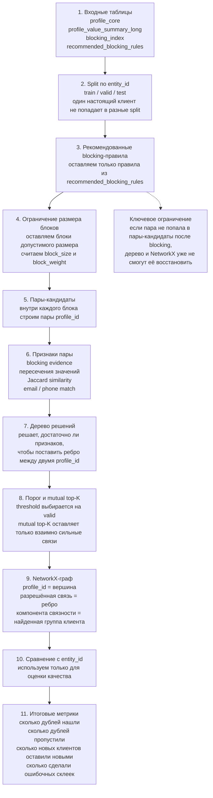

# Mermaid-схема алгоритма Graph + Tree ER

Этот код можно вставить в Markdown/Notion/GitLab/GitHub или в любой Mermaid renderer.

```mermaid
flowchart TD
    N1["1. Входные таблицы<br/>profile_core<br/>profile_value_summary_long<br/>blocking_index<br/>recommended_blocking_rules"]
    N2["2. Split по entity_id<br/>train / valid / test<br/>один настоящий клиент не попадает в разные split"]
    N3["3. Рекомендованные blocking-правила<br/>оставляем только правила из recommended_blocking_rules"]
    N4["4. Ограничение размера блоков<br/>оставляем блоки допустимого размера<br/>считаем block_size и block_weight"]
    N5["5. Пары-кандидаты<br/>внутри каждого блока строим пары profile_id"]
    N6["6. Признаки пары<br/>blocking evidence<br/>пересечения значений<br/>Jaccard similarity<br/>email / phone match"]
    N7["7. Дерево решений<br/>решает, достаточно ли признаков,<br/>чтобы поставить ребро между двумя profile_id"]
    N8["8. Порог и mutual top-K<br/>threshold выбирается на valid<br/>mutual top-K оставляет только взаимно сильные связи"]
    N9["9. NetworkX-граф<br/>profile_id = вершина<br/>разрешённая связь = ребро<br/>компонента связности = найденная группа клиента"]
    N10["10. Сравнение с entity_id<br/>используем только для оценки качества"]
    N11["11. Итоговые метрики<br/>сколько дублей нашли<br/>сколько дублей пропустили<br/>сколько новых клиентов оставили новыми<br/>сколько сделали ошибочных склеек"]
    LIMIT["Ключевое ограничение<br/>если пара не попала в пары-кандидаты после blocking,<br/>дерево и NetworkX уже не смогут её восстановить"]

    N1 --> N2
    N2 --> N3
    N3 --> N4
    N4 --> N5
    N5 --> N6
    N6 --> N7
    N7 --> N8
    N8 --> N9
    N9 --> N10
    N10 --> N11

    N3 -.-> LIMIT
```
